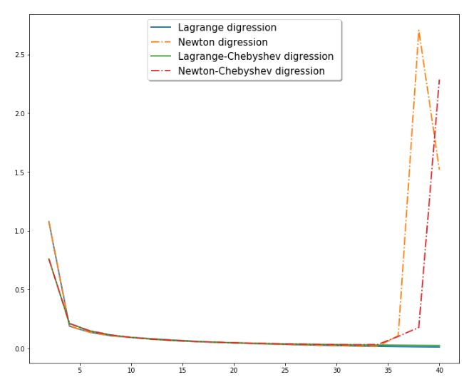

# Lagrange Newton Interpoliance
Interpolation with python
## The task was
Approximate given function using Lagrange method and its modification Newton method. 
## Key feauterus
- You can interpolate different functions by changing following function
```py
def f(x):
        return x**2 - np.arcsin(x-0.2)
```
- You can change constant easily
```py
global a, b, checkDotsNum
a,b = np.array([-1, 1])+0.2
checkDotsNum = 100
```
- It uses equidistant and optimal nodes of interpolation, so you can compare two approaches
## Results
Programm plots aproximation, so you can see it works very well!


Also you program shows digressions from test function and creates  table, that reflects information by text




